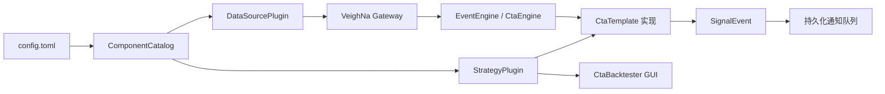

# 可扩展架构

TradePilot 使用组件注册和依赖注入隔离数据源、策略与应用生命周期。核心应用负责协调，不负责判断
某个数据源如何连接，也不负责解释某套策略的专用参数。

## 目录结构

```text
src/tradepilot/
├── app.py                         # 无界面应用生命周期
├── bootstrap.py                   # 内置组件装配和 entry point 发现
├── cli.py                         # 命令行入口
├── doctor.py                      # 只读诊断用例
├── research/
│   ├── backtester.py              # 官方 CtaBacktester 策略注册适配
│   └── gui.py                     # 图形化研究入口
├── core/
│   ├── components.py              # 插件抽象、注册表和组件目录
│   ├── config.py                  # 核心 TOML 配置
│   └── events.py                  # 稳定事件契约
├── data_sources/
│   └── tencent/
│       ├── client.py              # HTTP 客户端和纯解析器
│       ├── gateway.py             # 只读 VeighNa Gateway
│       └── plugin.py              # DataSourcePlugin 适配
├── strategies/
│   └── double_ma/
│       ├── base.py                # 实时和回测共用交叉规则
│       ├── strategy.py            # 仅通知 CTA 策略
│       ├── backtest.py            # 仅回测模拟成交策略
│       └── plugin.py              # StrategyPlugin 适配
└── notifications/
    └── feishu.py                   # 飞书客户端、发件箱和通知服务
```

包根目录只保留应用入口和装配代码。领域实现必须放在对应子包；一个新数据源或新策略拥有自己的目录，
实现细节不会进入 `core`。



## 配置选择

```toml
[data_source]
name = "tencent"
poll_interval_seconds = 3.0
stale_after_seconds = 30.0

[monitor]
symbols = ["515080.SSE"]
minimum_history_bars = 100

[strategy]
name = "double_ma_signal"
fast_window = 10
slow_window = 20
```

`name` 由核心配置解析，其余字段保留为组件参数。所选插件负责拒绝未知字段、检查类型和验证参数
关系。这样新策略可以拥有完全不同的参数，而不需要修改核心 `AppConfig`。

## 核心对象

### DataSourcePlugin

数据源插件负责：

- 声明唯一名称、显示名称和 VeighNa `BaseGateway` 子类
- 验证 `[data_source]` 参数
- 生成 Gateway 连接参数
- 为 `doctor` 提供统一的行情与历史诊断结果

当前内置实现是 `TencentDataSourcePlugin`。`TencentGateway` 仍在基础设施层拒绝所有委托，因此更换
策略不会绕过只读边界。

### StrategyPlugin

策略插件负责：

- 声明唯一名称、显示名称和 `CtaTemplate` 子类
- 可选声明独立的回测 `CtaTemplate` 类，由官方 CtaBacktester 加载
- 验证 `[strategy]` 参数和历史预热要求
- 为每个标的生成稳定的 CTA 实例名
- 生成传给 CTA 引擎的参数
- 报告预热状态、配置摘要和会话结束行为

当前内置实现是 `DoubleMaSignalStrategyPlugin`。实时类 `DoubleMaSignalStrategy` 只发布信号；研究类
`DoubleMaLongBacktestStrategy` 只允许在 `EngineType.BACKTESTING` 中产生模拟委托。二者共用
`DoubleMaStrategyBase`，保证交叉公式一致。

### ExtensionRegistry 与 ComponentCatalog

`ExtensionRegistry` 管理唯一名称并拒绝重复注册。`ComponentCatalog` 同时持有数据源与策略注册表，
根据配置解析当前组合。`TradePilotApp` 和 `doctor` 只依赖这些抽象对象。

应用构造函数允许直接注入自定义目录：

```python
application = TradePilotApp(config, custom_catalog)
```

这使测试可以使用假数据源，也允许部署代码替换内置实现。

## 新增数据源

1. 实现一个只读或正式券商 `BaseGateway`。
2. 继承 `DataSourcePlugin`，实现参数验证、连接设置和诊断。
3. 通过 Python entry point 注册。
4. 在配置中切换 `data_source.name`。

外部扩展包的 `pyproject.toml` 示例：

```toml
[project.entry-points."tradepilot.data_sources"]
broker_x = "my_tradepilot_plugin:BrokerXDataSourcePlugin"
```

插件可以导出插件实例，也可以导出无参数构造的插件类。TradePilot 启动时从
`tradepilot.data_sources` 组发现并注册它。

数据源扩展的公共基类导入路径是：

```python
from tradepilot.core.components import DataSourcePlugin, SymbolDiagnostic
```

腾讯 POC 永远不得用于自动交易。未来接入券商时，应另建数据源插件，不能在
`TencentGateway.send_order()` 中加入委托实现。

## 新增策略

1. 新建一个 `CtaTemplate` 子类，策略内部发布 `SignalEvent`。
2. 继承 `StrategyPlugin`，封装参数验证、实例命名和 CTA 参数转换。
3. 通过 Python entry point 注册。
4. 在配置中切换 `strategy.name`。

```toml
[project.entry-points."tradepilot.strategies"]
breakout_signal = "my_tradepilot_plugin:BreakoutSignalStrategyPlugin"
```

策略扩展的公共基类导入路径是：

```python
from tradepilot.core.components import StrategyPlugin
```

当配置切换到不同策略类时，TradePilot 会删除同名的旧 CTA 实例并按新类重建，避免把新参数错误地
写入旧策略对象。程序只协调 `tradepilot_` 前缀的实例。

## 稳定契约

扩展实现必须遵守：

- 数据源只发布合法、单调、带正确时区的行情对象。
- 通知策略不得直接调用委托 API。
- 回测策略必须在委托前校验 `EngineType.BACKTESTING`，不得注册到实时监控应用。
- 初始化历史只用于预热，不能发送历史信号。
- 策略信号必须使用 `SignalEvent`，由统一通知层去重和持久化。
- 实际数据源显示名称必须写入信号，不能在策略中硬编码腾讯。
- 单个标的初始化失败不能阻止其他标的运行。

## 扩展层级

当前 entry point 机制解决代码级替换和独立发布。未来若需要同一进程同时运行多套策略，应在
`config.toml` 中引入策略列表和独立实例组；当前版本仍明确规定一次运行选择一种策略类型，并为
自选列表中的每个标的创建一个独立实例。
